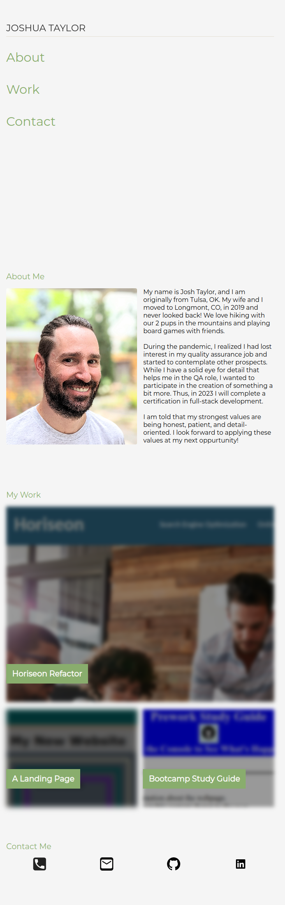

# <Portfolio>

## Description

This is my portfolio page giving a little about myself, displaying some of of my work,and a few ways to get in contact with me. The intention is for this to be a place for potential employers to view some of my work. I have tried to include much of what I have learned and intend to continue updating it as I learn more through my time at the DU Full Stack Coding Bootcamp. 

## Installation

N/A

## Usage

The website will resize several elements of itself depending on the device size the user is viewing it. The links at the time will scroll he user to the various sections of the page. Clicking any of the images in the 'My Work' section will open a tab to the deployed website. Hovering (or clicking for tablet and mobile devices) over the phone or email icon will provide my contact information. The GitHub and LinkedIn icons will open the relevant webpage in a new tab when clicked.

Deployed page link: https://josht-dev.github.io/Portfolio/

## Credits

N/A

## License

Refer to the LICENSE in the repo for the code. 
The font (Montserrat) is licensed under the SIL Open Font License (OFL).